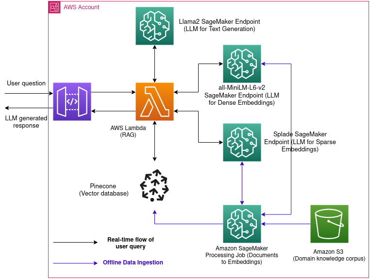

# Retrieval Augmented Generation for Medical Question-Answering with Llama-2-7b

## Table of Contents
- [Data](#data)
- [Method](#method)
- [Tech Stack](#tech-stack)

The medical field demands accuracy and precision, especially when it comes to question-answering systems. I leverage the capabilities of the Llama-2-7b model to produce a sophisticated medical question-answering system. Through the Retrieval Augmented Generation (RAG) approach, I augment the Llama-2-7b's existing knowledge by integrating a curated medical knowledge base, ensuring our answers are not just data-driven but contextually and medically accurate. This system promises reduced hallucinations typically seen in large language models and offers precise, relevant responses, all made possible with the strategic use of embeddings and the computational prowess of SageMaker and Pinecone.

## Data

The data source I used is 'pubmed', a reservoir of medical knowledge. Given the extensive nature of these texts and the constraints of model window sizes, I adopted a chunking strategy. This method involves breaking down the large text datasets into manageable portions, ensuring that the model can process and understand the context without being overwhelmed. 

## Method

- **Embeddings**: Embeddings are foundational to our strategy, allowing us to convert raw text data into a format that's easily digestible and actionable for our models.

1) **Dense Embeddings (MiniLM)**: Dense embeddings, generated from MiniLM, provide a compact representation of text data in the form of fixed-size vectors. Every piece of text, regardless of its length, is represented by a vector of the same size.
2) **Sparse Embeddings (Splade)**: Unlike dense embeddings, sparse embeddings from Splade are characterized by high-dimensional vectors where most of the values are zero. They can capture more nuanced relationships in the data.

- **Vector Store**: The vector index is the backbone of the Retrieval Augmented Generation (RAG) approach. It plays a pivotal role in storing embeddings and facilitating rapid retrievals. I used Pinecone as it is optimized for storing, managing, and querying high-dimensional vectors that numerically represent textual data. It facilitates rapid similarity searches and efficient storage, making it essential for applications that deal with large-scale textual information and require quick retrieval of semantically related content.

## Tech Stack

HuggingFace, Pinecone, Sagemaker, Llama2